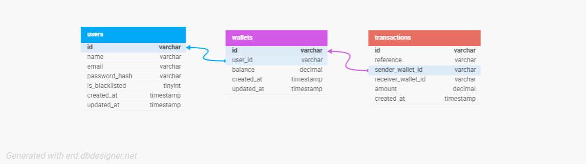

# Demo Credit — Wallet Service API

A wallet service MVP built for the Lendsqr Backend Engineering Assessment. It provides account creation, wallet funding, peer-to-peer transfers, and withdrawals with blacklist verification via the Lendsqr Adjutor Karma API.

## Live URL
```
https://riches-ogigi-lendsqr-be-test.onrender.com
```

## GitHub Repository
```
https://github.com/ricky-ultimate/demo-credit
```

---

## Table of Contents

- [Tech Stack](#tech-stack)
- [Architecture](#architecture)
- [ER Diagram](#er-diagram)
- [Project Structure](#project-structure)
- [Getting Started](#getting-started)
- [API Documentation](#api-documentation)
- [Design Decisions](#design-decisions)
- [Known Limitations](#known-limitations)

---

## Tech Stack

- **Runtime:** Node.js (LTS)
- **Language:** TypeScript
- **Framework:** Express
- **ORM:** Knex.js
- **Database:** MySQL (TiDB Serverless)
- **Auth:** JWT (faux token-based)
- **Testing:** Jest + ts-jest
- **Deployment:** Render

---

## Architecture

The project follows a layered architecture pattern:
```
Request → Route → Middleware → Controller → Service → Database
```

- **Routes** define endpoints and chain middleware
- **Middleware** handles authentication and validation before requests reach controllers
- **Controllers** are thin — they extract request data, call the service, and send responses
- **Services** contain all business logic and database operations
- **Models** are pure TypeScript interfaces with no runtime overhead

---

## ER Diagram



### Relationships

- One `user` has exactly one `wallet` — created atomically in the same database transaction during registration
- One `wallet` can have many `transactions` as either sender or receiver
- `sender_wallet_id` is nullable — deposits have no sender
- `receiver_wallet_id` is nullable — withdrawals have no receiver

---

## Project Structure
```
src/
├── config/         # Knex database client
├── constants/      # Environment variables and route constants
├── core/
│   ├── auth/       # Register, login (controller, service, routes)
│   └── wallet/     # Fund, transfer, withdraw, balance, history
├── middlewares/    # Auth, validation, error handling
├── migrations/     # Knex database migrations
├── models/         # TypeScript interfaces
├── tests/          # Unit tests
└── utils/          # Logger, response helpers, JWT, Adjutor, transaction ref
knexfile.ts         # Knex environment configuration
```

---

## Getting Started

### Prerequisites

- Node.js 18+
- A MySQL-compatible database (TiDB Serverless recommended)
- A Lendsqr Adjutor API key

### Installation
```bash
git clone https://github.com/ricky-ultimate/demo-credit
cd demo-credit
npm install
```

### Environment Variables

Copy `.env.example` to `.env` and fill in all values:
```bash
cp .env.example .env
```
```env
PORT=5001
NODE_ENV=development

DB_HOST=your_tidb_host
DB_PORT=4000
DB_USER=your_user
DB_PASSWORD=your_password
DB_NAME=demo_credit

JWT_SECRET=your_secret_key
JWT_EXPIRES_IN=24h

ADJUTOR_BASE_URL=https://adjutor.lendsqr.com
ADJUTOR_API_KEY=your_adjutor_api_key
```

### Run Migrations
```bash
npm run migrate:latest
```

### Start Development Server
```bash
npm run dev
```

### Run Tests
```bash
npm test
```

---

## API Documentation

### Base URL
```
https://riches-ogigi-lendsqr-be-test.onrender.com
```

### Authentication

All wallet endpoints require a Bearer token in the `Authorization` header:
```
Authorization: Bearer <token>
```

A token is returned on registration or login.

---

### Auth Endpoints

#### Register
```
POST /api/auth/register
```

**Body:**
```json
{
  "name": "John Doe",
  "email": "john@example.com",
  "password": "securepassword"
}
```

**Response `201`:**
```json
{
  "status": "success",
  "message": "Account created successfully",
  "data": {
    "token": "eyJ...",
    "user": {
      "id": "uuid",
      "name": "John Doe",
      "email": "john@example.com",
      "is_blacklisted": false,
      "created_at": "...",
      "updated_at": "..."
    }
  }
}
```

**Error responses:** `400` validation failed, `403` blacklisted user, `409` email already exists

---

#### Login
```
POST /api/auth/login
```

**Body:**
```json
{
  "email": "john@example.com",
  "password": "securepassword"
}
```

**Response `200`:** Same shape as register response.

**Error responses:** `400` validation failed, `401` invalid credentials

---

### Wallet Endpoints

All wallet endpoints require `Authorization: Bearer <token>`.

#### Get Balance
```
GET /api/wallet/balance
```

**Response `200`:**
```json
{
  "status": "success",
  "message": "Wallet balance retrieved",
  "data": { "balance": "5000.00" }
}
```

---

#### Fund Wallet
```
POST /api/wallet/fund
```

**Body:**
```json
{ "amount": 5000 }
```

**Response `200`:**
```json
{
  "status": "success",
  "message": "Wallet funded successfully",
  "data": { "balance": "5000.00" }
}
```

---

#### Transfer Funds
```
POST /api/wallet/transfer
```

**Body:**
```json
{
  "receiver_email": "jane@example.com",
  "amount": 1000
}
```

**Response `200`:**
```json
{
  "status": "success",
  "message": "Transfer successful",
  "data": { "balance": "4000.00" }
}
```

**Error responses:** `400` insufficient balance or self-transfer, `404` recipient not found

---

#### Withdraw Funds
```
POST /api/wallet/withdraw
```

**Body:**
```json
{ "amount": 500 }
```

**Response `200`:**
```json
{
  "status": "success",
  "message": "Withdrawal successful",
  "data": { "balance": "3500.00" }
}
```

**Error responses:** `400` insufficient balance

---

#### Transaction History
```
GET /api/wallet/transactions
```

**Response `200`:**
```json
{
  "status": "success",
  "message": "Transaction history retrieved",
  "data": {
    "transactions": [
      {
        "id": "uuid",
        "reference": "DC-1234567890-ABCD1234",
        "sender_wallet_id": null,
        "receiver_wallet_id": "wallet-uuid",
        "amount": "5000.00",
        "type": "deposit",
        "status": "success",
        "created_at": "..."
      }
    ]
  }
}
```

---

## Design Decisions

**Knex over a heavier ORM**
Knex gives direct SQL control which is essential for financial operations. The `db.transaction()` wrapper ensures that balance mutations and transaction record inserts are atomic — if either fails, both roll back.

**DECIMAL(15,2) for all monetary values**
Floating point arithmetic is not safe for money. `DECIMAL` stores exact values and prevents rounding errors that would compound across many transactions.

**One wallet per user, created at registration**
The wallet is created in the same database transaction as the user record. There is no way to have a user without a wallet or a wallet without a user. This simplifies every downstream operation — no conditional wallet creation, no orphan records.

**Transfer by email address**
Using email as the transfer identifier is more consumer-friendly than requiring wallet IDs or user IDs which are UUIDs. The service resolves the email to a wallet internally.

**Faux JWT authentication**
As permitted by the assessment brief, a simple signed JWT is returned on registration and login. The `authenticate` middleware verifies it on every protected route. No refresh tokens or session management.

**Blacklist check at registration and login**
The Adjutor Karma API is called once during `POST /api/auth/register` and `POST /api/auth/login`. If the identity is blacklisted, account creation is rejected immediately with a `403`.

**Lightweight custom validation middleware**
No external validation library is used. A simple rule-based `validate` middleware covers all required field types — string, email, and number — keeping the dependency footprint small.

---

## Known Limitations

**Adjutor test mode**
The Adjutor API account is currently in test mode pending KYC approval. In test mode, the API returns a mock karma hit for every identity regardless of actual blacklist status. The code detects the `mock-response` field in the response and bypasses the block, allowing registration to proceed normally. Once the account is switched to live mode, the bypass is automatically removed and real blacklist enforcement resumes. The blacklist blocking logic is fully covered in unit tests using mocked responses to verify correct behaviour in live mode.


**Render cold starts**
The free tier on Render spins down after inactivity. The first request after a period of inactivity may take 30–60 seconds to respond while the service wakes up.
